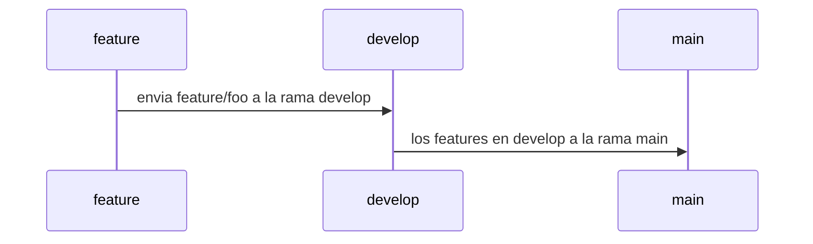

# SOCIAL OPLESK
### 🏴‍☠️ HACK-GROUP

<br/>

📚 docs [comandos git](https://gist.github.com/dasdo/9ff71c5c0efa037441b6) | [markdown 1](https://agea.github.io/tutorial.md/) | [markdown 2](https://docs.github.com/es/get-started/writing-on-github/getting-started-with-writing-and-formatting-on-github/basic-writing-and-formatting-syntax) | [archivos de salud](https://docs.github.com/es/communities/setting-up-your-project-for-healthy-contributions/creating-a-default-community-health-file)
---

```diff
- NOTA HACER LAS PRÁCTICAS MEDIANTE LA CONSOLA DE GIT BASH  
```

```
Se tienen 4 alias (alfa, bravo, charlie, delta), cada alia representa un integrante del equipo, 
si tu equipo tiene un integrante extra se llamara (echo) el procedimiento a realizar es el siguiente,
se necesita crear un circulo hábil en el manejo del pull request, para tal fin. 

Los integrantes deben definir la asignación de los alias del circuito
El circuito inicia con el usuario alfa
```
```diff
* Tienen que crear 4 repositorios y 1 repositorio extra, solo si tienen a echo en el equipo.
* El usuario a cargo del circuito según el turno del alias, aceptara las solicitudes de pull request del equipo
* Definir un contenido en el README.md con la siguiente estrucutra:
  * (titulo con el alias del encargado del repo / tabla de integrantes donde se refleje el nombre, ubicación de cada integrante) 
* Copie el fragmento de texto que esta contenido en el sector PULL_REQUEST_TEMPLATE en el archivo PULL_REQUEST_TEMPLATE.md
```
<br/>

|Hacks | Details | 
|----------|---------|
| H-1      | Pull Request alfa |
| H-2      | Pull Request bravo |
| H-3      | Pull Request charlie | 
| H-4      | Pull Request delta |
| H-5      | Pull Request echo |
<br/> 

---

### WORKFLOW



---
